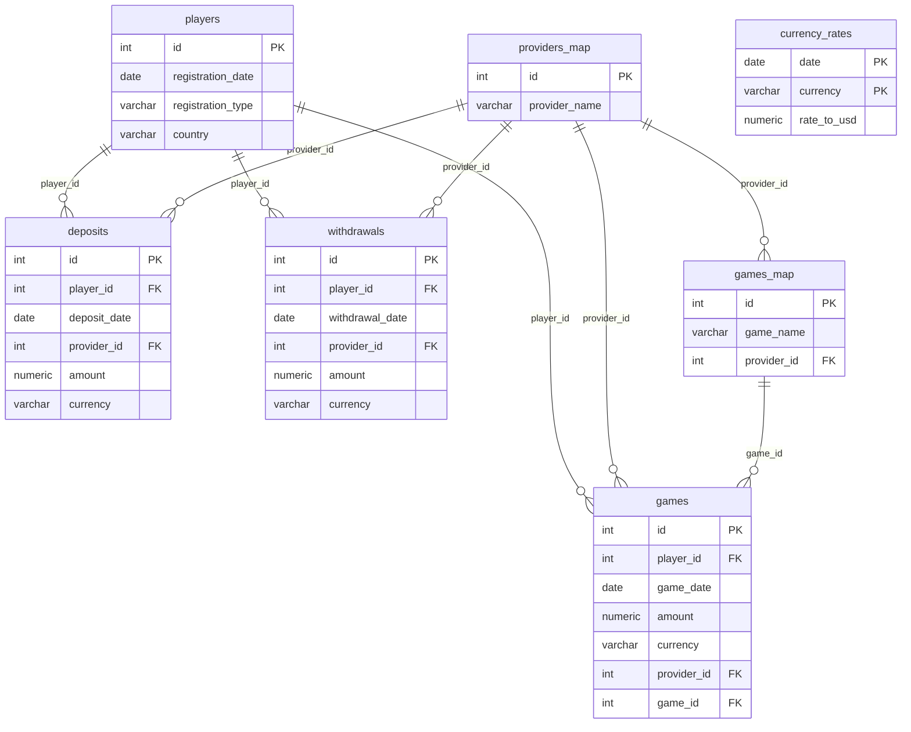

# Модель данных — ERD

Диаграмма рендерится на GitHub автоматически (mermaid).



## Слои (dbt)

```
raw.*  (CSV 1:1)
  └── staging  stg_*  (типизация, конвертация в USD)  [views]
        └── marts  monthly_summary  (месяц × страна)  [view]
```

`currency_rates` — справочник, подключается в staging-слое через «as-of» джойн
(последний курс с датой ≤ дате транзакции) для устойчивости к пропускам.
